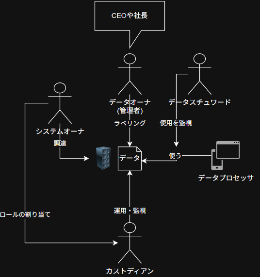

# Domain 1 <!-- markmap: fold -->
- Ethics
  - $\mathrm{(ISC)^2}$ Code of professional Ethics
    1. 社会，公共，公益から求められる信頼と信用，インフラを守る．
    2. 法律に違わず，公正かつ誠実に，責任を持って行動する．
    3. 当事者に対して十分かつ適切なサービスを提供する．
    4. 専門性を高め，維持する．
- Governance
  - COBIT
  - SABSA
  - PCI DSS
  - FedRAMP
  - ITIL
  - 3rd party governance
    - 組織が依存する3rdパーティに対するセキュリティ監視を実施する．
    - 定められた目標，要件，契約等の義務を遵守されているか検証することに重点を置く．
    - オープンな文書の交換とレビューをお互いが実施する．
    - ATO(運用許可)を維持する．
- Privacy
  - IP(Intellectual Property)
    | 種類                       | 法規制                    | 管轄    | 有効期限        | 保護対象     |
    | ------------------------ | ---------------------- | :---: | ----------- | -------- |
    | 商標(TradeMark, (TM), (R)) | Lanham Act             | USPTO | 更新可能        | ロゴ，スローガン |
    | 特許(Patent)               | -                      | USPTO | 20年         | 発明，プロセス      |
    | 営業秘密(Trade Secret)      | Economic Espionage Act | -     | 無し          | 営業秘密     |
    | 著作権(Copyright, (C))      | DMCA                   | -     | 70年or没後 50年 | 創作物，コード，文書      |
  - Licenses
    - DMCA
  - Import/Export
    - COCOM: 冷戦時代にNATOからWTOへの輸出を抑制する委員会
    - Wassenaar Arrangement: 通常兵器の蓄積を防止するための，輸入出品を追跡する仕組み
      - 暗号化製品も対象
    - EAR
      - 域外適用(米国→日本→第三国でも規制適用)
  - EU laws
    - GDPR
      - 72h rule: 72h以内に個人データ侵害を通知するルール
      - Adequacy decision: 十分性認定
        - SCC(SDPC): 十分性認定が無い場合に採用する契約条項
        - BCR: 企業の内部部門間でのデータ転送を規制する企業規則
      - Lawfulness, fairness and transparency: 法的根拠を持って，オープンかつ誠実にデータを扱うこと
      - Purpose limitation: データ収集の目的を文書化して開示すること
      - Data minimization: 目的達成のために必要な最小限のデータのみを保持すること
      - Accuracy: データを正確に維持すること
      - Storage limitation: 必要な期間のみデータを保持すること
        - 忘れられる権利: ユーザの要求に従ってデータを削除する．
      - Integrity and confidentiality: 完全性と機密性を保持すること
      - Accountability: データへのアクションについて説明責任が伴うこと
  - US laws
    - SOX: 上場企業へ財務報告の透明性及び文書化を定めた法律
    - GLBA(Gramm-Leach-Bliley Act): 金融業での顧客情報共有時のセキュリティを強化する法律
    - Amendent 4: 不当な捜査・押収から市民を保護する修正条文
    - USA patriot Act: テロ抑止を目的とした法律
      - CALEA: プロバイダ等の通信会社が政府の通信傍受を援助する
      - CLOUD: 国境を越えて企業が保有するデータへのアクセス手順を定めた法律
    - ECPA: 電子通信プライバシー法
    - FERPA: 家族教育権利及びプライバシー法
    - COPPA: 児童オンラインプライバシー保護法
    - HIPAA: 医療保険の相互運用及び説明責任に関する法律
      - プライバシーに焦点
    - HITECH: 経済的及び臨床的健全性のための医療情報技術に関する法律
      - セキュリティに焦点
    - FISMA: 連邦情報セキュリティ管理法
    - CFAA: コンピュータ不正行為防止法
    - CCPA: カリフォルニア消費者プライバシー法
  - Other laws
    - PIPEDA: カナダの個人情報に関する法律
    - PIPL: 中国のデータプライバシーに関する包括的な法律
    - POPIA: 南アフリカの個人情報保護法
- Responsibilities
  - Due Diligence
  - Due Care
- Risk management frameworks
  - CSF2.0(Cyber Security Framework 2.0)
    - Core
      - GOVERN; GV
        サイバーセキュリティを確実にするための役割，責任及びポリシを策定し，周知及び監督する．
      - IDENTIFY; ID
        資産，リスクを理解し，カタログ化する．
      - PROTECT; PR
        資産とデータを保護する．
      - DETECT; DE
        インシデントを検知する仕組みを設ける．
      - RESPOND; RS
        インシデントの軽減策を設ける．
      - RECOVERY; RC
        インシデントの回復策を設ける．
    - Tier: 適応レベル
      - Tier 1: Partial
      - Tier 2: Risk-Informed
      - Tier 3: Repeatable
      - Tier 4: Adaptive
    - Profile: As-Is/To-Be
      - Current profile
      - Target profile
  - RMF(NIST SP 800-37 Rev)
    - Prepare
      - 組織全体のリスクアセスメントを実施し，共通管理策を特定する．
      - システム境界を明らかにし，リスクアセスメントを行い，セキュリティ要件を特定する．
    - Categorize
      - システムをCIAの観点から分析し，高・中・低に決定する．
    - Select
      - システムの分類結果に基づき，ベースラインとなるセキュリティ管理策を選択する．
    - Implement
      - セキュリティ管理策を実装する．
      - セキュリティ管理策の変更内容を文書化する．
    - Assess
      - セキュリティ管理策が正しく実装されているかをアセスメントする．
      - アセスメント結果によって是正活動を行う．
    - Authorize
      - 上記ステップで得られたセキュリティ管理策によって低減されるリスクが受容可能であれば運用が認可される．
      - 運用認可責任者は，対象システムの運用によって生じるリスクを受容可能に収める責任を負う．
    - Monitor
      - 継続してアセスメントし，必要な場合はリスク対応の取り組みを実施する．
  - Risk management(CISSP CBK, some frameworks are mixed)
    1. Asset valuation
       - Quantitative: 定量的
       - Qualitative: 定性的
    2. Risk analysis
       - Quantitative
         - $SLE = AV\times EF$
           $ALE = SLE\times ARO$
       - Qualitative
         - Delphi method
         - Brainstorming
         - interviewing
       - Threats models
         - STRIDE
         - DREAD
         - PASTA
       - Controls
         - Physical control
           - Technical control
             - Administrative control
    3. Threatment
       - Transfer
         - Cyber security insurance
       - Mitigate
         - Safeguards
           - Directive
           - Deterrent
           - Preventative
         - Countermeasures
           - Detective
           - Corrective
           - Recovery
           - Compsensating
       - Avoid
       - Accept
    4. Assesment
       - SCA(Security Control Assesment)
         - NIST SP 800-53 Rev5
       - Documentation
         - Internal
           - Risk matrix/heatmap
           - Risk Registers
           - KRI(Key Risk Indicator)
         - External
           - Risk exposure
           - Policies and practices for risk management.
           - Financial statements
  - COSO
  - ISACA Risk IT
  - ISO 31000
  - TARA
  - FAIR
  - OCTAVE
# Domain 2 <!-- markmap: fold -->
- Data role
  - Data owner
  - Data steward
  - Data custodian
  - Data user
  - Data controller
  - Data processer
  - 
- Data lifecycle
  1. Classify
     - Security document
       - Policy
       - Standard
       - Baseline
       - Guidline
       - Procedure
     - Labeling: system readable
       | Level  | Government   | Nongovernment |
       | :----- | :----------- | :------------ |
       | Class3 | Top Secret   | Confidential  |
       | Class2 | Secret       | Private       |
       | Class1 | Confidential | Sensitive     |
       | Class0 | Unclassfied  | Public        |
     - Marking: human readable

  2. Protect based on classification
     - Use
       - Data in Rest
         - Encryption
         - Access Control
         - Backups to DR site
       - Data in Transit
         - DLP
         - TLS/VPN/Onion
       - Data in Use
         - Print masking
         - Release on memory
     - Archive
       - Retention period
       - Sites
         - DR
         - CSP
  3. Destruction
     - NIST SP 800-88 Rev
       - Clear💥
         - Format
         - Zero fill
         - Overwrite
         - Wipe
       - Purge💥💥
         - Degaussing
         - ATA secure erase
         - Cryptographic shredding
       - Destroy💥💥💥️
         - Shred✂️
         - Incinerate🔥
         - Spoil⚗️
         - Disintegrate🔨
  4. Assess & Review
# Domain 3 <!-- markmap: fold -->
- Cryptography
  - Hashing
    - MD5
    - SHA-1
    - SHA-2
    - SHA-3
  - Symmetric
    - Block
      - Modes
        - ECB
        - CBC
        - CFB
        - OFB
        - CTR
      - Algorithm
        - DES
        - 2DES
        - 3DES
        - AES(Rijndael)
        - Blowfish
    - Streaming
      - RC4
  - Asymmetric
    - Algorithm
      - El Gamal
      - RSA
      - DSA
      - ECDSA
    - KEX
      - Diffie-Hellmann
  - Classical
    - Caesar Cypher
    - Substitution Cypher
    - Steganography
  - Oracle
    - One-time Pads
- Principles of safe design
  - Least Privilege
  - Defence in Depth
    - Obscurity🗯️
    - Data Hiding🙈
  - Segragation of Duties🧑‍🤝‍🧑
  - Dual Castory(Quorum Authentication)👥
    - M of N access control
  - PbD(privacy by Design)🤫
  - Secure Default🔐
  - Shared Responsibility with CSP☁️
  - KISS🤪
  - Zero Trust🚫
    - Trust But Verify
- Security Frameworks
  - ISO 27001
  - ISO 27002
  - ITIL
  - FISMA
  - FedRAMP
  - Cyber Kill Chain
  - NIST SP 800-53(米国連邦情報システムのセキュリティ及びプライバシー管理の管理策)
- Certification standards
  - CC(Common Criteria)
    - ISO 15408
    - ST(Security Targets)/TOE: 対象の製品，製品のセキュリティコントロールを特定する文書
    - PP(Protection Profile): 製品のセキュリティ要件が書かれた文書
    - EAL
      - ALE1: 機能的保証
      - ALE2: 構造的保証
      - ALE3: 系統的にテスト & チェック
      - ALE4: 系統的に設計 & テスト & レビュー
      - ALE5: 半正式的に設計 & テスト
      - ALE6: 半正式的に検証済みの設計 & テスト
      - ALE7: 正式に検証された設計 & テスト
  - ITSEC
  - TCSEC(Orange Book)
- Security Model
  - Enterprise
    - ToGAF
    - Zachman
    - Sabsa
  - Lattice Based(MAC)
    - Bell-LaPadula
      - Simple security attribute
      - \* security attribute
    - Biba
      - Simple integrity attribute
      - \* integrity attribute
    - Lipner
  - Rule Based
    - Clark-Wilson
      - CDI(Constrained Data Item)
      - UDI(Unconstrained Data Item)
      - IVP(Integrity Veification Procedure)
      - TP(Transformation Procedure)
    - Brewer-Nash
    - Graham-Denning
    - Harrison-Ruzzo-Ullman
- TCB(Trusted Computing Base)
  - Reference Monitor
    - Security Kernel
      - Completness: 全てカーネルを経由すること
      - Isolation: カーネル自体があらゆる不正アクセスから保護されること
      - Verifiability: カーネルが設計仕様への適合を証明すること
  - Perimeter
  - Trusted hardware
    - TPM chip
    - Fortezza PC card
    - iButton
  - Process isolation
    - Memory Segmentation
    - Time division multiplexing
  - Processor states
    - Problem
    - Supervisor
  - Ring protection Model
    - Ring 0: Kernel
    - Ring 3: User program
- Safety of people
  - Control categories
    - Deter
    - Delay
    - Detect
    - Assess
    - Respond
  - Physical control
    - Lighting
      - Emergency Lighting
      - Tripped Lighting
    - Monitoring
      - CCTV
      - Passive RIP sensor
      - Wave motion sensor
      - Sound sensor
      - BMS
      - RIP Linear Beam sensor
    - Locks
    - Fencing
      - High fence
      - Partition
    - Doors
      - Card readers
      - Mantrap
      - Turnstile
      - Carbonated door
    - Security guard
    - Robot
    - Anti vehicle
      - Bollard
      - Spike
  - Disaster
    - Outages⚡
      - UPS
      - Generator
      - Dual power plant
      - Dual degradation
    - HVAC(Heat, Ventilation, Air Conditioning)🌡️️☁🍃
      - Static electricity
      - Chip cleap
      - Cold/Hot Aile
    - Fire🔥
      - Exitinguisher
        - A: 可燃物
        - B: 液体
        - C: 電気
        - D: 金属
        - K: キッチン
      - Sprinkler
        - Wet
        - Practive
        - Dry
        - Deluge: 一斉開放
      - AFFF(Aqueous Firefighting Foam)
      - CO2
      - Gas
        - Inergen
        - Haron
        - FM-200
        - Aero-K
        - Argonite
      - Firefighting
        - Axe
        - Pipe
    - Water💧
      - Pipe segregation
      - Avoid near rivers
# Domain 4 <!-- markmap: fold -->
- Architecture
  - QoS
    - Latency
    - Throughput
    - S/N ratio
  - Network architecture
    - Internet
      - GAN
      - WAN
      - MAN
      - LAN
      - PAN
    - Intranet
    - Extranet
      - Network sharing with stakeholders
  - Transport architecture
    - Cut-Thorugh
    - Store-and-Forward
  - Traffic flow
    - North-South traffic
    - East-West traffic
  - Topologies
    - Bus
    - Star
    - Ring
    - Mesh
    - Tree
  - Devices
    - Jumpbox(bastion)
    - Gateway
    - Router
    - Switching hub
    - Repeater hub
    - Amplifier
- Netowork Authentication
  - IEEE 802.1X
    - PAP
    - CHAP
    - EAP
      - LEAP
      - PEAP
      - EAP-POTP
      - TLS
- Wireless
  - IEEE 802.11(Wi-Fi)
    - Frequency
      - 2.4GHz
        - b
        - g
        - ax
      - 5GHz
        - a
        - ac
      - Both
        - n
    - Encryption
      - WEP
        - RC4
        - ⚠️Short IV
        - ⚠️All devices connected same AP share a same key
      - WPA
        - TKIP
          - RC4
      - WPA2
        - CCMP(Counter mode with CBC-MAC Protocol)
          - AES Encryption
          - MIC(Message Integrity Check)
      - WPA3
        - SAE(Simultaneous Authentication Of Equals)
        - Enterprise
          - IEEE 802.1X
            - RADIUS
          - GCMP(Galois/Counter Mode Protocol)
        - Personal
          - Pre-Shared Key
          - CCMP
    - Setup
      - WPS(Wiress Protected Setup)
    - Topology
      - AdHoc
      - Infrastructure
        - STA
        - AP
        - BSS
        - ESS
        - Roaming
  - IEEE 802.15.1(Bluetooth)
    - iBeacon
    - Zigbee
      - 128-bit Symmetric encryption
  - IEEE 802.16(WiMMax)
  - RFID
    - NFC
      - WPA2/WPA3
  - Satcom(Satellite Communication)
    - LEO
    - MEO
    - GEO
- Voice Communication
  - PSTN(Public Switched Telephone Network)
    - PBX(Private branch eXchange)
  - VoIP
  - Vishing
- OSI reference model
  - Application
    - HTTP/HTTPS
    - FTP/FTPS
    - TFTP
    - DHCP
    - DNS
      - A/AAAA
      - MX
      - CNAME
      - SOR
    - SNMP
    - SMTP
    - POP3
    - IMAP4
  - Presentation
    - ASCII/UTF-8
    - MPEG
    - JPEG
  - Session
    - iSCSI
    - TLS
    - Signal
    - BGP
  - Transport
    - TCP
    - UDP
  - Network
    - IPv4
    - IPv6
    - ICMP/IGMP
    - IPSec
  - Datalink
    - Ethernet
      - IBoE(InfiniBand over Ethernet)
    - ARP
    - PPP
    - PAP
    - CHAP
    - EAP
  - Physical
    - |Physical|Baseband|Broadband|
      |:----|:----|:----|
      |Coaxial|10BASE5 / 10BASE2|10BROAD36 / DOCSIS|
      |Unsheild Twisted Pair|10BASE-T / 1000BASE-T|ADSL (ITU-T G.992.x)|
      |Sheild Twisted Pair|Token Ring (IEEE 802.5) / 10GBASE-T|VDSL (ITU-T G.993.x)|
      |Fiber Optic|1000BASE-SX / LX / 10GBASE-SR|WDM / DWDM (ITU-T G.694.x)|
# Domain 5 <!-- markmap: fold -->
- IAAA
  - Identify
    - Username
    - ID
    - E-Mail
  - Authentication
    - Something You Know(Type I)
      - Password
        - NIST SP 800-63B
          - Hasing
          - 8-64 length
          - No need rotating
      - Passphrase
      - Questions
    - Something You Have(Type II)
      - ID card
      - Mobile phone
      - OTP
        - Syncronous OTP
        - Asynchronous OTP
        - Soft Tokens
        - Hard Tokens
    - Something You Are(Type III)
      - Biometrics
        - Zephyr Chart
        - Retina👁️
          - *PHI Privacy*
        - Iris👁️
        - Vasucular pattern🫀
        - Fingerprint🫵
        - Facial😐
        - Voice💬
        - Parameters
          - FRR(False Reject Rate(Type I))
          - FAR(False Accept Rate(Type II))
          - CEE(Crossover Error Rate)
      - Dynamics
        - Keystroke⌨️
        - Mouse🖱️
        - Gait🚶‍♂️
    - Somewhere You Are(Type IV)
      - IP Geolocation
      - GPS
  - Authorization
    - DAC
    - MAC(Ratice based)
      - Hierarchical
      - Compartmentalization
    - RBAC
    - RuBAC
    - ABAC
  - Acccounting
    - Logging
    - Non-repudiation
- Account Management
  - JIT
  - Provisioning
    - Entitlement
  - Deprovisioning
  - Access type
    - Permission
      - オブジェクトに対するアクション
    - Rights
      - システムに対するアクション
    - Privilege
      - Permission + Rights
      - Full control
- Protocols
  - SSO
    - Kerberos
      - KDC
        - AS
        - TGS
      - TGT(Ticket Granting Ticket)
      - ST(Service Ticket)
  - Federation
    - OIDC
    - OAuth
      - `state`
    - SAML
      - Assertion
      - Profiles
      - Bindings
      - Protocol
  - AAA
    - RADIUS
      - IEEE 802.x
    - ~~Diameter~~
    - TACACS+
      - CISCO
  - Directory
    - DAP(X.500)
    - LDAP
    - LDAPS
    - ADSI
      - LDAP/WinNT/Novell NDS
    - DSML
      - via HTTP
- ZTA
  - Policy Engine
  - Policy Administrator
  - Policy Enforcement Point
# Domain 6 <!-- markmap: fold -->
- Vulnabilities assessment
  - SCAP
    - CWE
    - CVE
    - CVSS
    - CPE
    - XCCDF
    - OVAL
  - Microsoft Security Bulletins
  - ~~Bugtraq~~
- Penetration testing
  - NIST SP 800-114
    - Planning
    - Discoery
    - Attack
    - Reporting
  - Method
    - Whitebox
    - Graybox
    - Blackbox
  - DAST
    - Fuzzing
      - Generation/Intelligence
      - Dumb
    - Sandbox
  - SAST
  - IAST
  - RASP
  - Tools
    - Vulnerabilities scanner
      - Nessus
      - OpenSCAP
    - Port scanner
      - Nmap
    - Web scanner
      - Nikto
      - BurpSuite
      - OWASP ZAP
    - SQLi
      - sqlmap
    - Fuzzer
      - zuff
      - dirb
      - ffuf
      - gobuster
# Domain 7 <!-- markmap: fold -->
- Collect & Control Evidence
  - Locard's Priciples: 異なる物が接触すると，必ずその接触痕跡を残す原理
  - Digital Forensics
    - Chain of custody
  - eDiscovery
    - EDRM
      1. Information Governance: eDiscoveryのために情報が整理されていることを確認
      1. Identification: 証拠開示に適切に応答できる情報の識別
      1. Preservation: 証拠となる情報を保護
      1. Collection: 情報を一元収集
      1. Processing: スクリーニングを実施し，必要な情報のみ抽出
      1. Review: レビュー
      1. Analysis: 分析
      1. Production: : 情報を他人と共有できるような形式に変換し，共有
      1. Presentation: 情報を開示
- Evidence
  - Evidence Rule
    - Authentic(真正性)
    - Accurate(正確性)
    - Complete(網羅性)
    - Convinicing(客観性)
    - Admissible(合法収集)
  - Evidence type
    - Real evidence: 物的証拠
      - 物理的な証拠
        - USBメモリ/HDD
    - Direct evidence: 直接証拠
      - 事件の事実を示す証拠
        - 有形/無形
        - 目撃者
        - 自白
        - Smoking gun(動かぬ証拠の慣用句)
    - Secnodary evidence: 二次的証拠
      - 原文から複製された証拠
        - 印刷されたログ
  - Ability
    - Best evidence rule: 最良証拠の原則
    - Hearsay rule: 伝聞証拠禁止の原則
    - Parol evidence: 口頭証拠排除の原則
  - Prohibit entrapment
- Investigateions type
  - Civil(民事)
    - 裁判所による当事者間の争いの解決
    - Preponderance of the evidence(証拠の優越性)
  - Criminal(刑事)
    - 法執行機関による調査
    - Beyond a reasonable doubt(合理的な疑いの余地が無い)証拠
  - Regulatory(規制)
    - 業界標準を遵守しているか
  - Administrative(行政/管理)
    - 組織内部の調査
    - 行政の翻訳に騙されないこと

- IR(Incident Response)
  - NIST SP 800-61
    1. Detection
       - IDS/IPS/SIEM/DLP/XDR
       - 通報窓口の設置
    2. Response
       - CSIRTへの連絡
    3. Mitigation
       - 問題の解消
       - 被害の最小限化
    4. Reporting
       - 組織内外への報告
    5. Recovery
       - システムの完全復旧
    6. Remediation
       - 脆弱性情報の横展開
    7. Lessons & Learned
       - 振り返り
- BCM(Business Continuity Management)
  - BIA(Business Impact Analysis/Assesment)
    1. Identifying priorities
       - RTO
       - MTD
       - WRT
       - RPO
    2. Risk identification
       - Natural threats
         - Flood
         - Fires
         - Typhoon
       - Person-made threats
         - Acts of terrorism
         - Bombings/Explosions
         - Strike
    3. Likelihood assessment
       - $SLE = AV\times FE$
    4. Impact analysis
       - $ALE = ALO\times SLE$
    5. Resource prioritization
  - Plans
    - BCP(Business Continuity Plan)
    - DRP(Disaster Recovery Plan)
    - CCP(Crisis Communications Plan)
    - CoOP(Continuity of Operations Plan)
    - CIR(Cyber Incident Recovery)
    - OEP(Occupant Emergency Plan)
    - BRP(Business Recocery Plan)
    - CMP(Crisis Management Plan)
  - Testing
    - Full interruption test
    - Parallel test
    - Tabletop exercise
    - Walkthrough
    - Checklist
  - Recovery strategies
    - Sites
      - Cold site
      - Warm site
      - Hot site
      - Mirror site
      - Mobile site
    - Copying
      - Electric vaulting: スケジュールされた時間にバックアップを自動転送
      - Jounaling: スケジュールされた時間にトランザクションログを自動転送
      - Shadowing: ミラーリング
    - RAID
      - Striping(RAID 0)
      - Mirroring(RAID 1)
      - Striping & Mirroring(RAID 10)
      - Parity(RAID 5)
      - Double parity(RAID 6)
    - Backup
      - GFS(Grandfather/Father/Son)
      - Tower of Hanoi
      - Six Cartridge Weekly
    - Clustring
      - High Availability
      - Load Balancing
- Change Management
  - Change request
  - Assessment
    - Emergency
    - Standard
  - Approval
  - Testing
    - Regression testing
    - Mutation testing
  - Planning
  - Documentation
  - Controls
    - Request control: ユーザが変更をリクエストし，マネージャが効果を分析し，開発者がタスク順位付けできている
    - Change control: 複数の開発者がソリューションを作成してテスト可能
    - Release control: 全変更が理解されていて，受入テストか含まれる
    - Structure control: ソフトウェアのバージョン変更がCMに従っている
- SOC
  - SSAE18
    - | 区分 | SOC 1 (財務報告) | SOC 2 (セキュリティ等) | SOC 3 (セキュリティ等) |
      | :--- | :--- | :--- | :--- |
      | **主な対象** | 財務報告に係る内部統制 | セキュリティ、可用性、処理の整合性、機密保持、プライバシー | SOC 2と同等 |
      | **主な利用者** | ユーザー企業の財務諸表監査人 | ユーザー企業の経営層、顧客、規制当局 | 一般公開用 (誰でも閲覧可) |
      | **詳細度** | 高 (詳細な制御記述あり) | 高 (詳細な制御記述あり) | 低 (要約版) |
      | **Type 1** | 指定時点の設計評価 | 指定時点の設計評価 | 指定時点の設計評価 |
      | **Type 2** | 一定期間の運用有効性評価 | 一定期間の運用有効性評価 | 一定期間の運用有効性評価 |
# Domain 8 <!-- markmap: fold -->
- SLC
  - SDLC
    - Concept definition
    - Requirements
    - Architecture & Design
    - Development
      - Waterfall
        - Repeatable Watferfall
      - Spiral
      - IPTs
      - Agile
        - Scrum
        - Kanban
        - XP
        - SAFe
      - DevOps
        - DevSecOps
        - DevQAOps
    - Testing
      - Coverage
        - Code Coverage
      - Misuse Test
      - Interface Test
    - Operation
      - Monitoring
        - Active Monitoring
        - Passive Monitoring
          - RUM 
- MM(Maturity Model)
  - CCM(Capability Maturity Model)
    - Initial
    - Repeatable
    - Defined
    - Managed
      - 定量評価
    - Optimizing
  - SAMM(Software Assurance Maturity Model)
    - Governance
    - Design
    - Implementation
    - Verification
    - Operations
- Acquire Softwares
  - SLA
  - MOU
  - ISA(Interconnection Security Agreement)
  - Contracts
- Vulnerabilities
  - SQLi
  - XSS
  - CSRF
  - SSRF
  - BoF
  - Race Conditions
  - TOC/TOU
  - Citizen Developers
  - Backdoor(Trapdoors)
- Secure programming
  - Code Review
  - Input Validation on server side
  - Session Management
  - Polyinstantation